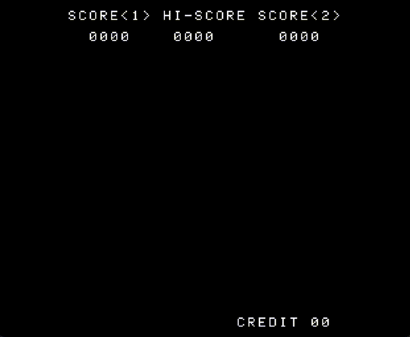

# Intel 8080 CPU Emulator - Space Invaders

A faithful software emulation of the Intel 8080 microprocessor that runs the classic 1978 Space Invaders arcade game in its original, unmodified form. This emulator recreates the original arcade hardware environment at the CPU instruction level, allowing authentic ROM execution exactly as it ran on the original machine.

**CS 467 Capstone Project** | **Oregon State University** | **Summer 2025**


*Classic Space Invaders running on the emulator*

## Project Highlights

- **CPU Implementation**: Intel 8080 instruction set (192/244 OPCODES) with cycle-accurate timing
- **Hardware Emulation**: Authentic port-based I/O, interrupt handling, and memory-mapped graphics
- **SDL2 Graphics**: Real-time rendering with proper vertical blank interrupt timing
- **Audio System**: Original arcade sound effects using SDL2_mixer
- **Development Tools**: Integrated disassembler for ROM analysis and debugging
- **Team Collaboration**: Built using Git workflows, code reviews, and modern C development practices

## Technical Stack

- **Language**: C
- **Graphics/Audio**: SDL2, SDL2_mixer
- **Build System**: Make
- **Platforms**: Linux, macOS (Intel/Apple Silicon), Windows (WSL2)
- **Key Concepts**: CPU emulation, memory management, interrupt handling, hardware I/O, low-level systems programming

## Architecture

The emulator is organized into modular components:

```
intel-8080-cpu-emulator/
├── src/
│   ├── cpu/           # Intel 8080 CPU core and disassembler
│   ├── graphics/      # SDL2 display and rendering
│   └── io/            # Input handling and sound system
├── roms/              # Space Invaders ROM files
├── tests/             # Test suite and CPU diagnostics
└── docs/              # Documentation
```

### Core Components

**CPU Emulator** (`src/cpu/`)
- Implements 192 Intel 8080 opcodes
- Accurate flag handling (Zero, Sign, Parity, Carry, Auxiliary Carry)
- Proper interrupt processing and timing
- Stack operations and memory addressing modes

**Disassembler** (`src/cpu/disassembler.c`)
- Standalone ROM analysis tool
- Integrated debugging support within emulator
- Human-readable assembly output with address labels

**Graphics System** (`src/graphics/`)
- Emulates Space Invaders' 256×224 rotated display
- Vertical blank interrupt generation
- Proper VRAM mapping and frame buffer management

**I/O System** (`src/io/`)
- Keyboard input mapping to arcade controls
- Port-based hardware I/O (IN/OUT instructions)
- Original arcade sound effects playback

## Quick Start

### Prerequisites

**Ubuntu/Debian/WSL2:**
```bash
# Option 1: Automatic (recommended)
make install-deps

# Option 2: Manual installation
sudo apt update
sudo apt install -y git build-essential libsdl2-dev libsdl2-mixer-dev
```

**macOS:**
First, install Homebrew if you don't have it:
```bash
/bin/bash -c "$(curl -fsSL https://raw.githubusercontent.com/Homebrew/install/HEAD/install.sh)"
```

> **Note for Developers**: See [docs/DEVELOPMENT.md](docs/DEVELOPMENT.md) for IDE setup, debugging tips, and advanced configuration.

Then install SDL2 dependencies:
```bash
brew install sdl2 sdl2_mixer
```

### Installation

```bash
# Clone the repository
git clone https://github.com/Brad-S1/intel-8080-cpu-emulator.git
cd intel-8080-cpu-emulator

# Build the emulator
make clean && make

# Build all tools (emulator + disassembler)
make both
```

### Acquiring ROMs

⚠️ **Legal Notice**: Space Invaders ROM files are copyrighted. You must legally obtain your own copy.

The emulator requires four ROM files (`invaders.h`, `invaders.g`, `invaders.f`, `invaders.e`) combined into a single file:

```bash
# Create ROM directory
mkdir -p roms/space_invaders

# Combine ROM files (if you have them as separate files)
cat invaders.h invaders.g invaders.f invaders.e > roms/space_invaders/invaders

# Verify (should be 8192 bytes)
ls -l roms/space_invaders/invaders
```

### Running Space Invaders

```bash
# Start the emulator
./bin/emulator roms/space_invaders/invaders
```

**Controls:**
- `C` - Insert Coin
- `1` - Start 1-Player Game
- `2` - Start 2-Player Game
- `←/→` - Player 1 Move Ship
- `Q/W` - Player 2 Move Ship
- `SPACE` - Player 1 Fire
- `E` - Player 2 Fire

## Development Tools

### Disassembler

Analyze ROM files and convert machine code to readable assembly:

```bash
# Display disassembly
./bin/disassembler roms/space_invaders/invaders

# Save to file
./bin/disassembler roms/space_invaders/invaders > disassembly.txt
```

**Example Output:**
```
0000  c3 d4 18    JMP   $18d4
0003  c3 91 01    JMP   $0191
0006  00          NOP
0007  00          NOP
0008  c3 a5 01    JMP   $01a5
```

### Makefile Commands

```bash
make              # Build emulator (default)
make both         # Build emulator and disassembler
make disassemble  # Build disassembler only
make test         # Run emulator with ROM
make clean        # Remove build artifacts
make help         # Show all commands
```

## Learning Outcomes

This project provided hands-on experience with:

- **Low-level Systems Programming**: Direct hardware emulation, memory management, and CPU architecture
- **Computer Architecture**: Instruction decoding, processor flags, addressing modes, and interrupt handling
- **Real-time Systems**: Frame timing, vertical blank synchronization, and performance optimization
- **Software Engineering**: Modular architecture, team collaboration via Git, code reviews, and documentation
- **Debugging Complex Systems**: Using disassemblers, memory inspection, and step-through debugging

## Testing

The project includes:
- Unit tests for individual CPU operations
- Integration tests for hardware I/O
- Manual testing with the full Space Invaders ROM

```bash
# Run test suite
make test
```

## Project Structure

```
intel-8080-cpu-emulator/
├── src/
│   ├── cpu/
│   │   ├── disassembler.h        # Disassembler interface
│   │   ├── disassembler.c        # Core disassembly functions
│   │   ├── disassembler_main.c   # Standalone disassembler
│   │   └── emulator_shell.c      # Main emulator with CPU core
│   ├── graphics/
│   │   └── cpu.h                 # CPU interface
│   │   └── graphics_tester.c     # Display testing - development use only
│   │   └── graphics.c            # SDL2 display and rendering
│   │   └── graphics.h            # Graphics interface
│   └── io/
│       ├── input.c               # Keyboard input handling
│       ├── input.h               # Input interface
│       ├── machine_io.h          # Machine/IO interface
│       └── sound.c               # Audio playback system
│       └── sound.h               # Sound interface
├── roms/                         # ROM file directory
├── tests/                        # Test suite
├── build/                        # Compiled object files (created by make)
├── bin/                          # Executable files (created by make)
├── docs/                         # Documentation
├── Makefile                      # Build system
└── README.md
```

## Team

- **Abraham Byun**
- **Kevin Ho**
- **Mintae Kim**
- **Brad Sommer**

## License

This project is for educational purposes. Space Invaders is a registered trademark of Taito Corporation. ROM files are not included and must be legally obtained.

## Related Resources

- [Intel 8080 Assembly Language Programming Manual](http://bitsavers.org/components/intel/MCS80/9800301D_8080_8085_Assembly_Language_Programming_Manual_May81.pdf)
- [Computer Archaeology - Space Invaders](https://computerarcheology.com/Arcade/SpaceInvaders/)
- [Emulator 101 Tutorial](https://web.archive.org/web/20240718053956/http://emulator101.com/)

---

*Built as part of CS 467 Capstone Project at Oregon State University*